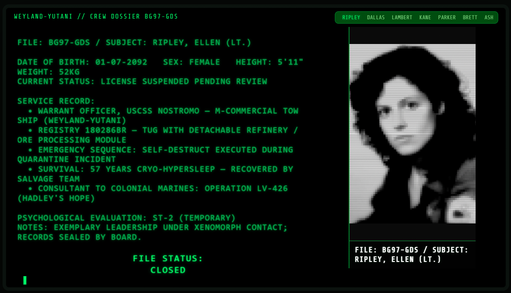
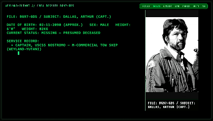

# Nostromo CRT v1.5

Retro-CRT interface inspired by *Alien (1979)* and Weyland-Yutani archives.  
Line-by-line printing with cursor, scanline effects, glowing text, and authentic terminal sound.  
Includes hidden password-protected mode with **SPECIAL ORDER 937** alert.  

---

## Features
- Line-by-line text printing (JS animation)  
- Scanlines & CRT glow (CSS custom effects)  
- Terminal sound (Web Audio API)  
- Hidden password mode + alert system  
- Authentic DOS/RETRO aesthetics  

---

## Tech Stack
  
  
  

---

## 🚀 Demo
👉 Live demo: [GitHub Pages](https://kirill-pavlenko-by.github.io/Alien-Nostromo-archives/)  

*(or check out the video demo on YouTube/TikTok)*  

---

## 📜 License
  
© 2025 **Kiryl Paulenka**
